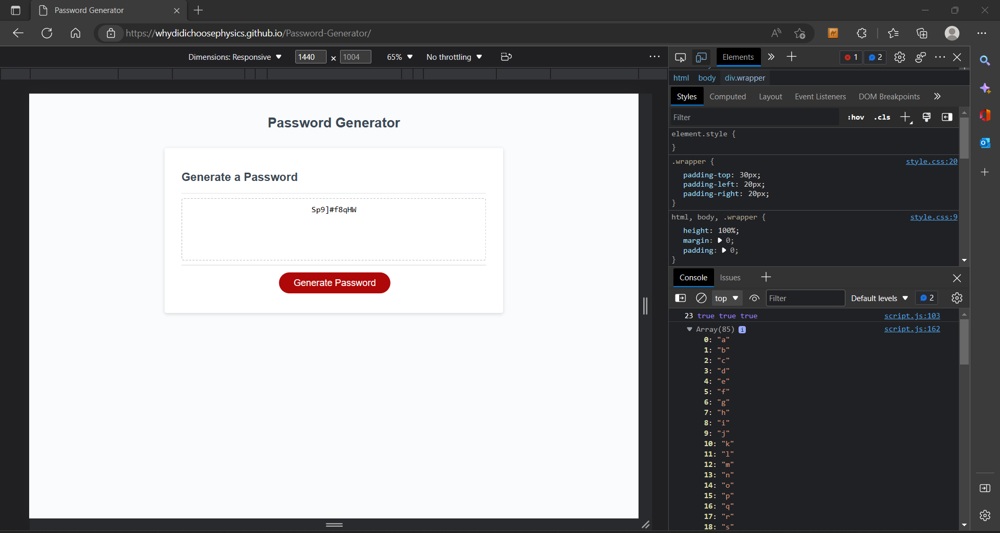

# Password-Generator

Can be accessed at:
https://whydidichoosephysics.github.io/Password-Generator/

Explaining the Code:

A first function getPasswordOptions was created that prompts the user for input about
the password length, and whether it should contain Uppercase letters, Numbers, or Special Characters:

- Although it asks the user to choose a length between 8-64, no limitation has been put in place for that
- The password uses lowercase letters as default options if no other characters are chosen

A function mergeArraysOptions uses many nested if statements to decide
what characters are available to be used for the password depending on user input

A function getRandom returns a random value from a specified array

Finally the password is generated with the function generatePassword:

- The password starts as an empty string
- A random character from the merged array is added at the end of the string for the length defined by the user
